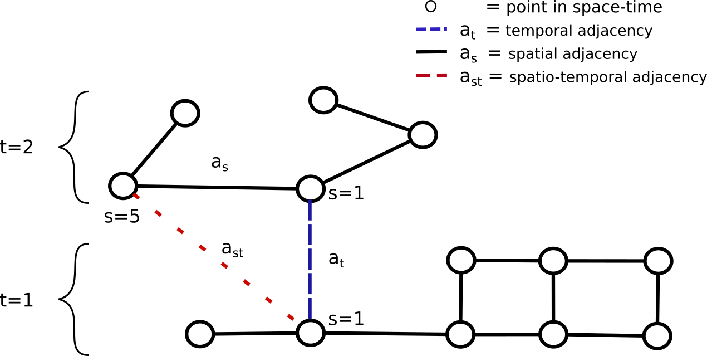

# Enhancing AutoML for tackling climate change with universal GNNs

We propose a universal graph representation of data that is able to capture arbitrary 
real world events as attributes of nodes, edges and graphs. When data can be structured 
as a graph, graph neural networks (GNNs) can solve a wide range of prediction tasks 
by predicting these as attributes of nodes, edges or entire (sub)graphs.

The figure below visualizes this for spatio-temporal data. Data points can be 
represented as nodes, edges or graphs. Nodes have a (virtual) coordinate in 
time and a (virtual) coordinate in space, which together assign these a unique point
in space-time. Edges have a unique connection between two points in space-time.
Edges can be of three different types. First, they can describe temporal adjacency 
where they connect two nodes at the same point in space but different points in time.
Second, they can describe spatial adjacency where they connect two nodes a the same 
point time but different points in space. Third, they can describe spatio-temporal 
adjacency where they connect two nodes at different points in time and in space.




We want to demonstrate that a wide range of real world events can be structured 
as spatio-temporal graph data, without having to do with time and space on first 
sight. This is why we mention virtual coordinates in time and space.

## Download
Download this repository to your home directory:

```
cd 
git clone https://github.com/ArsamAryandoust/UniversalGNNs
cd UniversalGNNs
```

## Docker

Build main Docker container:

```
docker build -t main Docker
```


## Jupyter notebooks inside Docker containers

Build Jupyter notebook container:

```
docker build -t main_notebook DockerNotebook
```

Compute using CPU only:

```
docker run -it -v ~/UniversalGNNs:/UniversalGNNs -p 3333:1111 main_notebook
```

Compute using GPUs too:

```
docker run -it --gpus all -v ~/UniversalGNNs:/UniversalGNNs -p 3333:1111 main_notebook
```


